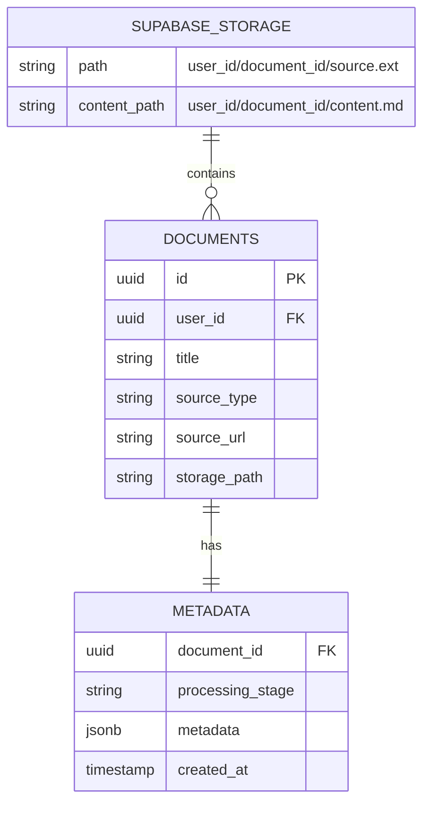

# Rhizome V2 Processing Pipeline (Visual Guide)

**Last Updated:** 2025-10-05

A visual guide to how documents flow through the Rhizome system, from upload to connection detection.

---

## Table of Contents
1. [Complete Pipeline Overview](#complete-pipeline-overview)
2. [Stage 1: Document Ingestion](#stage-1-document-ingestion)
3. [Stage 2: Content Extraction](#stage-2-content-extraction)
4. [Stage 2.5: Obsidian Integration](#stage-25-obsidian-integration)
5. [Stage 3: Semantic Chunking](#stage-3-semantic-chunking)
6. [Stage 4: Embedding Generation](#stage-4-embedding-generation)
7. [Stage 5: Connection Detection](#stage-5-connection-detection)
8. [Reader Experience](#reader-experience)
9. [Error Handling & Fallbacks](#error-handling--fallbacks)

---

## Complete Pipeline Overview


---

## Stage 1: Document Ingestion

### Input Methods


### Storage Strategy



---

## Stage 2: Content Extraction


---

## Stage 2.5: Obsidian Integration

### Pre-Chunking Review Workflow

```mermaid
flowchart TD
    Start[Upload Document] --> Check{Review Before<br/>Chunking?}

    Check -->|No ✗| Direct[Direct to AI Chunking<br/>Cost: ~$0.20]
    Check -->|Yes ✓| Extract[PDF/EPUB Extraction<br/>Generate Clean Markdown]

    Extract --> Simple[Simple Heading-Based Chunking<br/>FREE - No AI Cost]
    Simple --> Export[Export to Obsidian Vault<br/>Open in Obsidian via URI]

    Export --> Status[Document Status:<br/>awaiting_manual_review]

    Status --> UserEdit[User Edits Markdown<br/>Fix formatting, headers, tables]

    UserEdit --> Continue[Click "Continue Processing"]
    Continue --> Sync[Sync Edited Markdown<br/>from Obsidian]

    Sync --> AIChunk[AI Chunking on<br/>EDITED Markdown<br/>Cost: ~$0.20]

    Direct --> Embeddings[Embeddings + Connections]
    AIChunk --> Embeddings

    style Check fill:#fff4e6
    style Simple fill:#c8e6c9
    style AIChunk fill:#fff4e6
    style UserEdit fill:#e3f2fd

    Note1[Cost Savings:<br/>❌ Old: AI chunk → discard → AI chunk = $0.40<br/>✅ New: Simple chunk → AI chunk edited = $0.20]
    style Note1 fill:#c8e6c9
```

### Post-Completion Obsidian Sync


### Obsidian Export Flow


### Why Use Obsidian Integration?


---

## Stage 3: Semantic Chunking

### Complete Chunking Flow


### Fuzzy Matching Strategies


### Chunk Metadata Structure


---

## Stage 4: Embedding Generation


---

## Stage 5: Connection Detection

### 3-Engine Architecture

```mermaid
graph TD
    Start[Document Chunks] --> Orch[Orchestrator]

    Orch --> E1[Engine 1:<br/>Semantic Similarity<br/>Weight: 0.25]
    Orch --> E2[Engine 2:<br/>Contradiction Detection<br/>Weight: 0.40]
    Orch --> E3[Engine 3:<br/>Thematic Bridge<br/>Weight: 0.35]

    E1 --> Method1[Vector Search<br/>pgvector cosine distance<br/>No AI calls]
    E2 --> Method2[Metadata Analysis<br/>Concept + polarity matching<br/>No AI calls]
    E3 --> Method3[AI Analysis<br/>Cross-domain bridges<br/>~200 AI calls/doc]

    Method1 --> Score1[Similarity Scores<br/>0.7-1.0]
    Method2 --> Score2[Tension Scores<br/>0.0-1.0]
    Method3 --> Score3[Bridge Scores<br/>0.0-1.0]

    Score1 --> Agg[Score Aggregation]
    Score2 --> Agg
    Score3 --> Agg

    Agg --> Weight[Apply User Weights<br/>weighted_sum = Σ(score × weight)]

    Weight --> Norm[Normalize<br/>Softmax/Linear/Sigmoid]

    Norm --> Filter{Score ≥<br/>Threshold?}
    Filter -->|No| Discard[Discard Connection]
    Filter -->|Yes| Save[(Save to Database)]

    Save --> Done[Connections Complete]

    style E1 fill:#e3f2fd
    style E2 fill:#ffebee
    style E3 fill:#fff4e6
    style Orch fill:#f3e5f5
    style Done fill:#e1f5e1
```

### Engine 1: Semantic Similarity


### Engine 2: Contradiction Detection


### Engine 3: Thematic Bridge


### Orchestrator Score Aggregation


---

## Reader Experience

### Viewport Tracking Flow


### Why Accurate Offsets Matter


---

## Error Handling & Fallbacks

### Chunking Failure Recovery


### Connection Detection Failures

```mermaid
flowchart TD
    Start[Run All 3 Engines] --> E1[Engine 1:<br/>Semantic Similarity]
    Start --> E2[Engine 2:<br/>Contradiction Detection]
    Start --> E3[Engine 3:<br/>Thematic Bridge]

    E1 --> R1{Success?}
    E2 --> R2{Success?}
    E3 --> R3{Success?}

    R1 -->|Yes| S1[47 connections]
    R1 -->|No| F1[0 connections<br/>Log warning]

    R2 -->|Yes| S2[23 connections]
    R2 -->|No| F2[0 connections<br/>Corrupted metadata]

    R3 -->|Yes| S3[15 connections]
    R3 -->|No| F3[0 connections<br/>AI timeout]

    S1 --> Combine
    F1 --> Combine
    S2 --> Combine
    F2 --> Combine
    S3 --> Combine
    F3 --> Combine

    Combine[Combine Results] --> Total[Total: 47 + 23 + 15<br/>= 85 connections]

    Total --> Quality{Quality<br/>Acceptable?}
    Quality -->|Yes| Done[Degraded but Functional]
    Quality -->|No| Warn[Warn User:<br/>Partial results only]

    style Done fill:#c8e6c9
    style Warn fill:#fff9c4
```

### Cost Protection

```mermaid
flowchart TD
    Start[Thematic Bridge Engine] --> Filter[Aggressive Filtering<br/>importance > 0.6<br/>cross-document<br/>different domains]

    Filter --> Count{Candidate<br/>Pairs?}

    Count --> Process[Process Pairs<br/>AI Analysis]

    Process --> Check{AI Calls<br/>Made?}

    Check -->|< 300| Continue[Continue Processing]
    Continue --> Process

    Check -->|≥ 300| Stop[Budget Exceeded<br/>Stop Engine]

    Stop --> Log[Log Warning:<br/>Budget limit reached]

    Log --> Return[Return Connections<br/>Found So Far]

    Return --> Result[User Gets:<br/>✓ Semantic connections<br/>✓ Contradictions<br/>✓ Partial bridges]

    style Filter fill:#fff4e6
    style Stop fill:#ffccbc
    style Result fill:#c8e6c9

    Note[500-page book:<br/>382 chunks × 382 = 145,924 pairs<br/>After filtering: ~200 pairs<br/>Budget: 300 AI calls max]
    style Note fill:#e3f2fd
```

---

## Performance Characteristics

### Processing Timeline (500-page book)

```mermaid
gantt
    title Document Processing Timeline
    dateFormat X
    axisFormat %s

    section Extraction
    PDF Upload to Gemini    :0, 30
    Gemini Processing       :30, 180
    Markdown Generation     :180, 300

    section Chunking
    Batch Creation          :300, 360
    AI Semantic Analysis    :360, 1200
    Offset Correction       :1200, 1320
    Deduplication          :1320, 1380

    section Embeddings
    Batch Processing        :1380, 1440
    Vector Storage         :1440, 1500

    section Connections
    Semantic Similarity     :1500, 1620
    Contradiction Detection :1500, 1680
    Thematic Bridge        :1500, 2100
    Score Aggregation      :2100, 2160

    section Complete
    Ready for Reading      :2160, 2220
```

### Cost Breakdown (500-page book)

**Normal Processing:**
```mermaid
pie title Cost Distribution (~$0.54 total)
    "PDF Extraction ($0.12)" : 22
    "Semantic Chunking ($0.20)" : 37
    "Embeddings ($0.02)" : 4
    "Thematic Bridge ($0.20)" : 37
```

**With Pre-Chunking Review:**
```mermaid
pie title Cost Distribution (~$0.54 total - Same Cost!)
    "PDF Extraction ($0.12)" : 22
    "Semantic Chunking ($0.20)" : 37
    "Embeddings ($0.02)" : 4
    "Thematic Bridge ($0.20)" : 37
```

**Cost Comparison:**
| Mode | Extraction | Chunking | Total | Notes |
|------|-----------|----------|-------|-------|
| **Normal** | $0.12 | $0.20 | $0.54 | Direct AI chunking |
| **Pre-Review** | $0.12 | $0.20 | $0.54 | Simple chunks (free) → AI chunking edited markdown |
| **Old Bug** | $0.12 | $0.40 | $0.74 | AI chunking twice (fixed!) |

---

## Key System Insights

```mermaid
mindmap
  root((Rhizome V2<br/>Processing))
    AI + Fuzzy Matching
      AI: Semantic boundaries
      AI: Metadata extraction
      Fuzzy: Offset accuracy
      Partnership model
    3-Engine Connections
      Semantic: Fast baseline
      Contradiction: Tensions
      Thematic: Cross-domain
      Weighted aggregation
    Graceful Degradation
      Auto-split oversized
      Fuzzy offset correction
      Regex fallback
      Never lose data
    Cost-Aware Design
      Aggressive filtering
      Metadata reuse
      Budget protection
      $0.54 per 500-page book
    Viewport-Driven UX
      Accurate offsets
      Scroll-based detection
      Connection panel
      One-click navigation
```

---

## Related Documentation

- [Architecture Overview](./ARCHITECTURE.md)
- [ASCII Version](./PROCESSING_PIPELINE.md) (terminal-friendly)
- [ECS Implementation](./ECS_IMPLEMENTATION.md)
- [Testing Strategy](./testing/TESTING_README.md)
- [Code Examples](./CODE_EXAMPLES.md)

---

**Completed Features**:
- [x] Obsidian Integration (export, sync, advanced URI)
- [x] Pre-Chunking Review Workflow (save $0.20 per document)
- [x] Post-Completion Sync with Annotation Recovery
- [x] Double-Chunking Cost Bug Fix

**Next Steps**:
- [ ] Continue Reader UI (markdown renderer, virtual scrolling)
- [ ] Implement Annotations (text selection → ECS persistence)
- [ ] Build Connection Panel (display 3-engine results)
- [ ] Add Study System (flashcards with FSRS)
- [ ] Create Export (ZIP bundles with markdown + annotations)
