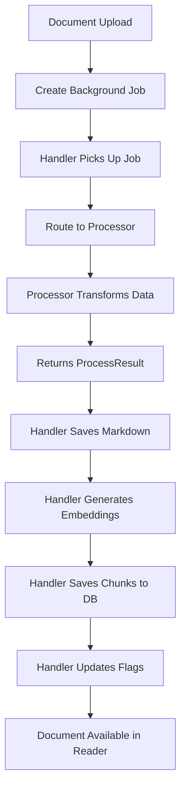

# Upload Processing Workflow

> **Last Updated**: January 29, 2025  
> **Status**: Architecture refactored to enforce single responsibility principle

## Overview

The document processing system follows a clear separation of concerns where:
- **Processors** only transform data (extraction, markdown conversion, chunking)
- **Handlers** orchestrate all I/O operations (storage, embeddings, database)

## Architecture Principles

### Single Responsibility Principle

Each component has one clear responsibility:

1. **Processors** (`worker/processors/*.ts`)
   - Extract content from source format
   - Convert to clean markdown
   - Create semantic chunks
   - Extract metadata
   - **NO** storage operations
   - **NO** database operations
   - **NO** embedding generation

2. **Handler** (`worker/handlers/process-document.ts`)
   - Orchestrate the entire workflow
   - Call appropriate processor based on source type
   - Save markdown to Supabase storage
   - Generate embeddings for chunks
   - Insert chunks with embeddings to database
   - Update document availability flags

## Processing Flow



## Processor Pattern

All processors follow this pattern:

```typescript
class ExampleProcessor extends SourceProcessor {
  async process(): Promise<ProcessResult> {
    // 1. Extract content from source
    const content = await this.extractContent()
    
    // 2. Convert to markdown
    const markdown = await this.convertToMarkdown(content)
    
    // 3. Create chunks for search
    const chunks = await this.createChunks(markdown)
    
    // 4. Extract metadata
    const metadata = this.extractMetadata(content)
    
    // 5. Return complete result (NO I/O operations)
    return {
      markdown,
      chunks,
      metadata,
      wordCount: /* calculate */,
      outline: /* extract */
    }
  }
}
```

## Handler Responsibilities

The handler (`process-document.ts`) performs these operations after the processor returns:

```typescript
// 1. Call processor
const result = await processor.process()

// 2. Save markdown to storage
const markdownPath = `${userId}/${documentId}/content.md`
await supabase.storage.from('documents').upload(markdownPath, result.markdown)

// 3. Generate embeddings
const embeddings = await generateEmbeddings(result.chunks)

// 4. Save chunks with embeddings
await supabase.from('chunks').insert(
  result.chunks.map((chunk, i) => ({
    ...chunk,
    document_id,
    embedding: embeddings[i]
  }))
)

// 5. Update document flags
await updateDocumentStatus(
  supabase,
  document_id,
  'completed',
  true, // markdown_available
  true  // embeddings_available
)
```

## Supported Source Types

| Source Type | Processor | Input Method |
|-------------|-----------|--------------|
| `pdf` | PDFProcessor | File upload |
| `youtube` | YouTubeProcessor | URL paste |
| `web_url` | WebProcessor | URL paste |
| `markdown_asis` | MarkdownProcessor | File upload (preserve) |
| `markdown_clean` | MarkdownProcessor | File upload (AI clean) |
| `txt` | TextProcessor | File upload |
| `paste` | PasteProcessor | Direct paste |

## Database Flags

The `documents` table has two critical flags that must be set for documents to appear in the reader:

- `markdown_available`: Set to `true` when markdown is saved to storage
- `embeddings_available`: Set to `true` when chunks with embeddings are saved

Both flags are set by the handler after successful processing.

## Error Handling

Each stage has specific error handling:

1. **Processor Errors**: Caught by handler, status set to 'error'
2. **Storage Errors**: Retry logic, fallback to error status
3. **Embedding Errors**: Retry with smaller batches, log failures
4. **Database Errors**: Transaction rollback, preserve document state

## Monitoring

Key metrics to monitor:

- Processing time per document type
- Storage upload success rate  
- Embedding generation time
- Database insertion performance
- Flag consistency (completed docs with flags=true)

## Migration History

- **Migration 017**: Fixed existing documents with incorrect flags
- Phase 1: Emergency fixes to restore functionality
- Phase 2: Architecture cleanup to enforce patterns

## Development Guidelines

When creating new processors:

1. Extend `SourceProcessor` base class
2. Implement only the `process()` method
3. Return complete `ProcessResult`
4. Do NOT perform any I/O operations
5. Follow existing processor patterns

## Testing

Run tests with:

```bash
# Worker tests
cd worker && npm test

# Integration tests
cd worker && npm run test:integration

# Main app tests
npm test
```

## Common Issues

1. **Documents not appearing**: Check both availability flags
2. **Processing stuck**: Check background_jobs table
3. **Storage errors**: Verify Supabase storage permissions
4. **Embedding failures**: Check Gemini API quota