# PRP: Idempotent Retry Logic for Document Processing

**Status**: Draft
**Created**: 2025-10-04
**Priority**: P0 - Critical
**Estimated Effort**: 8-12 hours

## Executive Summary

Fix critical race condition causing FK violations and data loss when document processing jobs timeout and retry. Large EPUBs (500+ pages) take 14+ minutes to process, triggering "stale job" recovery that deletes chunks while collision detection is actively using them.

**Impact**:
- FK violations prevent 94% of connections from being saved
- Data loss (41 vs 61 expected chunks)
- Users cannot see document connections

**Root Cause**: Non-idempotent retry logic treats partial completion as "never started", unconditionally deleting chunks that are in active use by downstream jobs.

**Solution**: Implement checkpointed processing phases with heartbeat mechanism and idempotent operations.

## Problem Statement

### Observed Failures

**Timeline of Failure (from logs):**
```
T+0:00  → EPUB processing starts (expecting 61 chunks)
T+14:00 → Connection timeout/job marked "stale"
T+14:05 → Stale recovery: DELETE all chunks
T+14:10 → Reprocessing creates new chunks with new IDs (only 41 created)
T+14:15 → Collision detection runs with OLD (deleted) chunk IDs
         → FK violation: source_chunk_id not in chunks table
         → Only 6/106 connections saved (94% failure)
```

**Error Message:**
```
insert or update on table "connections" violates foreign key constraint
"connections_source_chunk_id_fkey"
Key (source_chunk_id)=(e3a5eb30-7dae-497b-8b8b-39ce8c5230d4) is not present
in table "chunks"
```

### Current vs Expected Behavior

| Current (Broken) | Expected (Fixed) |
|------------------|------------------|
| 10-minute timeout → job marked stale | 30-minute timeout with heartbeat |
| Retry deletes ALL chunks unconditionally | Resume from checkpoint, preserve chunks |
| Collision detection references deleted chunks | Wait for embeddings to complete |
| 41 chunks saved (data loss) | 61 chunks saved (complete) |
| 0 connections (FK violations) | 97+ connections (success) |

## Root Cause Analysis

### Current Architecture Problems

**File**: `worker/handlers/process-document.ts`

1. **No Heartbeat Mechanism** (Lines 62-211)
   - Long AI processing (5-15 minutes) doesn't update job timestamp
   - Worker marks job "stale" after 10 minutes
   - Stale recovery triggers retry while original job still running

2. **Unconditional Chunk Deletion** (Lines 188-200)
   ```typescript
   // Current (BAD): Always deletes chunks
   console.log('🧹 Cleaning existing chunks...')
   await supabase
     .from('chunks')
     .delete()
     .eq('document_id', documentId)
   ```
   - No check if embeddings/connections are in progress
   - Deletes chunks that collision detection is actively using
   - No stage-aware cleanup logic

3. **No Stage Checkpointing**
   - Caches AI results in `job.metadata` (Lines 97-114) ✅ GOOD
   - But doesn't track which processing stages completed
   - Retry starts from beginning instead of resuming

### Concurrency Race Condition

```mermaid
sequenceDiagram
    participant W as Worker 1
    participant DB as Database
    participant C as Worker 2 (Collision)

    W->>DB: Process document → Create 61 chunks
    W->>DB: Queue collision detection job
    C->>DB: Start collision detection
    Note over W: Connection timeout (14 min)
    W->>DB: Mark job "stale"
    W->>DB: DELETE chunks (stale recovery)
    Note over C: Still processing with old chunk IDs
    C->>DB: INSERT connections
    DB-->>C: FK violation (chunks don't exist)
```



## Proposed Solution

### Architecture: Checkpointed Processing Phases

**Key Principles:**
1. **Heartbeat**: Update job timestamp every 5 minutes during processing
2. **Stage Tracking**: Save completed stages to `job.metadata`
3. **Conditional Cleanup**: Only delete chunks if starting fresh
4. **Idempotent Operations**: All database writes can be safely retried
5. **Async Connections**: Don't block document completion on collision detection

### Processing Stages

```typescript
type ProcessingStage =
  | 'pending'          // Job created
  | 'extracting'       // AI processing markdown + chunks
  | 'extracted'        // Cached in job.metadata ✓
  | 'saving_markdown'  // Upload to storage
  | 'markdown_saved'   // content.md persisted ✓
  | 'chunking'         // Insert chunks to database
  | 'chunked'          // Chunks in database ✓
  | 'embedding'        // Generate embeddings
  | 'embedded'         // Embeddings complete ✓
  | 'complete'         // Document ready (connections run async)
  | 'failed'           // Unrecoverable error
```

**Checkpoint Resume Logic:**
```typescript
// Resume from last completed stage
if (stage === 'pending') {
  await extract() // AI processing
  await saveToMetadata('extracted')
}

if (stage === 'extracted') {
  await saveMarkdown() // Storage upload
  await saveToMetadata('markdown_saved')
}

if (stage === 'markdown_saved') {
  await insertChunks() // Database insert
  await saveToMetadata('chunked')
}

// etc...
```

## Implementation Blueprint

### Phase 1: Critical Fixes (P0 - Immediate)

#### Task 1.1: Add Job Heartbeat

**File**: `worker/handlers/process-document.ts`

**Current** (Lines 62-116):
```typescript
// No heartbeat during AI processing
const result = await processor.process() // Takes 5-15 minutes
```

**Proposed**:
```typescript
// Add heartbeat timer
const heartbeatInterval = setInterval(async () => {
  console.log('[Heartbeat] Updating job timestamp...')
  await supabase
    .from('background_jobs')
    .update({
      started_at: new Date().toISOString() // Reset timeout
    })
    .eq('id', job.id)
}, 5 * 60 * 1000) // Every 5 minutes

try {
  const result = await processor.process()
} finally {
  clearInterval(heartbeatInterval) // Always cleanup
}
```

**Validation**:
```bash
cd worker && npm run test:integration
```

---

#### Task 1.2: Increase Stale Timeout

**File**: `worker/index.ts` (Lines 32-65)

**Current**:
```typescript
const STALE_THRESHOLD = 10 * 60 * 1000 // 10 minutes - TOO SHORT
```

**Proposed**:
```typescript
const STALE_THRESHOLD = 30 * 60 * 1000 // 30 minutes - Safe for large docs
const HEARTBEAT_INTERVAL = 5 * 60 * 1000 // 5 minutes

// Jobs sending heartbeats won't be marked stale
const staleJobs = jobs.filter(j => {
  const elapsed = Date.now() - new Date(j.started_at).getTime()
  return elapsed > STALE_THRESHOLD
})
```

**Validation**:
```bash
cd worker && npm test -- index.test.ts
```

---

#### Task 1.3: Add Stage Tracking to Metadata

**File**: `worker/handlers/process-document.ts` (Lines 97-114)

**Current** (caching only):
```typescript
metadata: {
  cached_chunks: result.chunks,
  cached_markdown: result.markdown,
  cached_metadata: result.metadata,
  // ... other cached fields
}
```

**Proposed** (add stage tracking):
```typescript
metadata: {
  // Existing caching (keep this)
  cached_chunks: result.chunks,
  cached_markdown: result.markdown,
  cached_metadata: result.metadata,
  cached_word_count: result.wordCount,
  cached_outline: result.outline,
  cache_created_at: new Date().toISOString(),

  // NEW: Stage tracking
  processing_stage: 'extracted', // Current stage
  completed_stages: ['extracting'], // Stages done
  stage_timestamps: {
    extracting: new Date().toISOString()
  },
  last_heartbeat: new Date().toISOString()
}
```

**Helper Function**:
```typescript
async function updateStage(
  supabase: SupabaseClient,
  jobId: string,
  stage: ProcessingStage
) {
  const { data: job } = await supabase
    .from('background_jobs')
    .select('metadata')
    .eq('id', jobId)
    .single()

  const metadata = job?.metadata || {}
  const completedStages = metadata.completed_stages || []

  await supabase
    .from('background_jobs')
    .update({
      metadata: {
        ...metadata,
        processing_stage: stage,
        completed_stages: [...completedStages, stage],
        stage_timestamps: {
          ...metadata.stage_timestamps,
          [stage]: new Date().toISOString()
        },
        last_heartbeat: new Date().toISOString()
      }
    })
    .eq('id', jobId)
}
```

**Validation**:
```bash
cd worker && npm run test:integration
```

---

#### Task 1.4: Conditional Chunk Deletion

**File**: `worker/handlers/process-document.ts` (Lines 188-200)

**Current** (unconditional delete):
```typescript
console.log('🧹 Cleaning existing chunks...')
await supabase
  .from('chunks')
  .delete()
  .eq('document_id', documentId)
```

**Proposed** (stage-aware cleanup):
```typescript
// Check if we're starting fresh or resuming
const stage = job.metadata?.processing_stage || 'pending'
const isResume = ['chunked', 'embedded', 'complete'].includes(stage)

if (isResume) {
  console.log(`♻️  Resuming from stage: ${stage}, keeping existing chunks`)
} else {
  console.log('🧹 Cleaning chunks for fresh processing...')
  await supabase
    .from('chunks')
    .delete()
    .eq('document_id', documentId)
}
```

**Validation**:
```bash
cd worker && npm run test:integration
# Should test both fresh processing and resume scenarios
```

---

### Phase 2: Important Improvements (P1 - This Week)

#### Task 2.1: Async Connection Detection

**Current**: Blocks document completion on collision detection
**Proposed**: Queue as separate job

**File**: `worker/handlers/process-document.ts` (Lines 213-224)

**Current**:
```typescript
// Wait for all processing to complete
await generateEmbeddings()
await detectConnections() // Blocks here (3-5 min)

return { status: 'complete' }
```

**Proposed**:
```typescript
// Complete main job after embeddings
await generateEmbeddings()
await updateStage(supabase, job.id, 'embedded')

// Queue connection detection as async job
await supabase
  .from('background_jobs')
  .insert({
    user_id: job.user_id,
    job_type: 'detect_connections',
    entity_type: 'document',
    entity_id: documentId,
    status: 'pending',
    input_data: {
      document_id: documentId,
      chunk_count: chunks.length,
      trigger: 'document-processing-complete'
    }
  })

return {
  status: 'embedded',
  message: 'Document ready, finding connections in background...'
}
```

**Validation**:
```bash
cd worker && npm run test:integration
```

---

#### Task 2.2: Integration Tests for Retry Scenarios

**New File**: `worker/tests/integration/retry-safety.test.ts`

```typescript
describe('Retry Safety', () => {
  test('should resume from checkpoint after timeout', async () => {
    // 1. Start processing, complete extraction
    const job = await startProcessing(largeDocument)
    await waitForStage(job.id, 'extracted')

    // 2. Simulate timeout/retry
    await markJobStale(job.id)

    // 3. Retry should NOT re-run extraction (cached)
    const retryJob = await retryProcessing(job.id)
    const aiCallsBefore = getAICalls()
    await waitForCompletion(retryJob.id)
    const aiCallsAfter = getAICalls()

    expect(aiCallsAfter).toBe(aiCallsBefore) // No AI calls on retry
  })

  test('should NOT delete chunks during embeddings', async () => {
    // 1. Complete chunking phase
    const job = await startProcessing(document)
    await waitForStage(job.id, 'chunked')
    const chunkIds = await getChunkIds(document.id)

    // 2. Simulate retry during embeddings
    await markJobStale(job.id)
    await retryProcessing(job.id)

    // 3. Chunk IDs should remain the same
    const newChunkIds = await getChunkIds(document.id)
    expect(newChunkIds).toEqual(chunkIds)
  })

  test('should prevent FK violations on connection detection', async () => {
    // 1. Complete processing
    const job = await startProcessing(document)
    await waitForStage(job.id, 'embedded')

    // 2. Start collision detection
    const connectionJob = await queueCollisionDetection(document.id)

    // 3. Simulate document reprocessing during connection detection
    await retryProcessing(job.id)

    // 4. Connection job should complete without FK errors
    await expect(waitForCompletion(connectionJob.id)).resolves.not.toThrow()
  })
})
```

**Validation**:
```bash
cd worker && npm run test:integration -- retry-safety.test.ts
```

---

## Migration Path

### Database Changes (Optional Enhancement)

**New Migration**: `supabase/migrations/030_processing_checkpoints.sql`

```sql
-- Add last_heartbeat column for stale detection
ALTER TABLE background_jobs
ADD COLUMN last_heartbeat TIMESTAMPTZ;

-- Update stale job query to use heartbeat
CREATE INDEX idx_background_jobs_heartbeat
ON background_jobs(last_heartbeat)
WHERE status = 'processing';

-- Helper function to check if job is truly stale
CREATE OR REPLACE FUNCTION is_job_stale(job background_jobs)
RETURNS BOOLEAN AS $$
BEGIN
  RETURN COALESCE(job.last_heartbeat, job.started_at) < NOW() - INTERVAL '30 minutes';
END;
$$ LANGUAGE plpgsql IMMUTABLE;
```

**Note**: This migration is optional - heartbeat can use `started_at` field for MVP.

---

## Validation Gates

### Pre-Implementation Checklist
- [ ] Read current `worker/handlers/process-document.ts` implementation
- [ ] Understand caching mechanism (Lines 62-116)
- [ ] Review stale job recovery logic in `worker/index.ts` (Lines 32-65)
- [ ] Check migration 029 for chunk unique constraints

### Per-Task Validation

**After Each Code Change:**
```bash
# 1. Type check
cd worker && npx tsc --noEmit

# 2. Lint
cd worker && npm run lint

# 3. Unit tests
cd worker && npm test

# 4. Integration tests
cd worker && npm run test:integration

# 5. Full validation suite
cd worker && npm run test:full-validation
```

### End-to-End Validation

**Test Scenarios:**
1. **Small document** (<50 pages): Should complete all phases without timeout
2. **Large document** (500 pages): Should send heartbeats, complete successfully
3. **Simulated timeout**: Kill job during embeddings, retry should resume
4. **Simulated crash**: Kill job during extraction, retry should use cache
5. **Connection detection**: Should run async, not block document completion

**Validation Script**: `scripts/validate-retry-safety.ts`
```typescript
// Test all retry scenarios
async function validateRetrySafety() {
  console.log('Testing retry safety...')

  // Test 1: Fresh processing
  const doc1 = await uploadDocument('small.pdf')
  await assertCompletes(doc1.id, '5 minutes')

  // Test 2: Cached processing (retry)
  await markJobStale(doc1.id)
  await assertCompletes(doc1.id, '1 minute') // Should be faster (cached)

  // Test 3: Large document with heartbeat
  const doc2 = await uploadDocument('large.epub')
  await assertCompletes(doc2.id, '20 minutes')
  await assertNoStaleRecovery(doc2.id)

  console.log('✅ All retry safety tests passed')
}
```

---

## Rollout Plan

### Phase 1: Critical Fixes (Day 1-2)
1. Add heartbeat mechanism (Task 1.1)
2. Increase stale timeout (Task 1.2)
3. Add stage tracking (Task 1.3)
4. Conditional chunk deletion (Task 1.4)
5. Deploy to development environment
6. Test with V. novel (previously failing case)

### Phase 2: Improvements (Day 3-5)
1. Async connection detection (Task 2.1)
2. Integration tests (Task 2.2)
3. Deploy to production
4. Monitor for FK violations (should be zero)

### Monitoring

**Key Metrics:**
- FK violation rate (should drop to 0%)
- Stale job recovery rate (should drop significantly)
- Average processing time per document size
- Cache hit rate on retries

**Alerts:**
- FK violations in `connections` table
- Jobs stuck in `processing` >30 minutes without heartbeat
- Abnormal chunk deletion patterns

---

## Risks & Mitigations

| Risk | Mitigation |
|------|------------|
| Heartbeat adds DB load | Batched updates every 5 minutes (low impact) |
| Stage metadata grows large | Limit to essential fields, clean up old jobs |
| Race condition still possible | Integration tests verify FK safety |
| Breaking existing processors | Backward compatible (stages optional) |

---

## Success Criteria

✅ **Must Have:**
- [ ] No FK violations on connection insertion
- [ ] Large documents (500 pages) process without data loss
- [ ] Retry resumes from checkpoint (no duplicate AI calls)
- [ ] All validation gates pass

✅ **Nice to Have:**
- [ ] Sub-30 minute processing for 500-page books
- [ ] Async connection detection doesn't block document completion
- [ ] Monitoring dashboard shows 0% FK violation rate

---

## References

### Codebase Files
- `worker/handlers/process-document.ts` - Main processing handler
- `worker/index.ts` - Job orchestration and stale recovery
- `worker/processors/base.ts` - Base processor with progress tracking
- `supabase/migrations/029_add_job_caching.sql` - Job metadata support

### Related Issues
- FK violations: `connections_source_chunk_id_fkey`
- Data loss: 41 vs 61 chunks
- Stale job recovery triggering incorrectly

### Test Commands
```bash
# Worker validation
cd worker && npm run test:full-validation

# Specific retry tests
cd worker && npm run test:integration -- retry-safety.test.ts

# Main app tests (if UI changes)
npm run test:critical
```

---

## Confidence Score

**8/10** - High confidence for one-pass implementation

**Reasoning:**
- ✅ Codebase research complete (existing patterns identified)
- ✅ Clear root cause (non-idempotent retry logic)
- ✅ Solution builds on existing infrastructure (metadata, caching)
- ✅ Validation gates well-defined (integration tests)
- ⚠️ Race conditions require careful testing
- ⚠️ Large-scale testing needed to verify heartbeat timing

**Risks for Implementation:**
- Timing edge cases in concurrent job processing
- Ensuring all processors call heartbeat correctly
- Backward compatibility with in-flight jobs

---

## Task Breakdown

See detailed implementation tasks in: [`docs/tasks/idempotent-retry-logic.md`](../tasks/idempotent-retry-logic.md)
