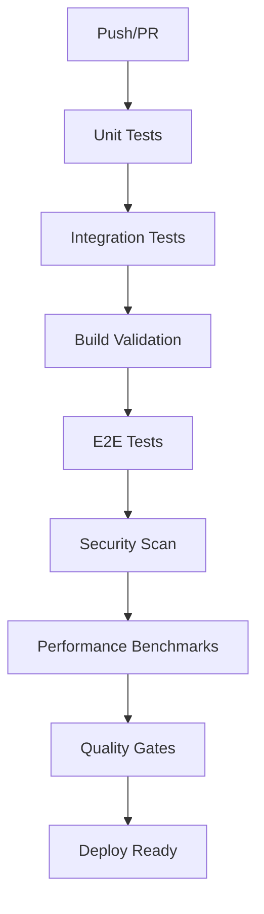

# CI/CD Testing Pipeline

> **Comprehensive testing automation for Rhizome V2**

## Overview

Our CI/CD pipeline ensures code quality through automated testing at multiple levels:

- **Unit Tests**: Fast feedback on component behavior
- **Integration Tests**: Multi-component system validation  
- **E2E Tests**: Complete user journey verification
- **Security Scans**: Dependency and code security checks
- **Performance Benchmarks**: Regression detection

## Pipeline Architecture



## Workflows

### Main Test Pipeline (`.github/workflows/test.yml`)

Runs on every push and pull request:

```yaml
name: Test Suite
on:
  push:
    branches: [ main, develop, 'feature/*' ]
  pull_request:
    branches: [ main, develop ]

jobs:
  test:           # Unit & Integration Tests
  e2e-tests:      # End-to-End Tests  
  quality-gates:  # Final Validation
```

**Triggers**: 
- Push to main/develop
- Pull requests
- Feature branch pushes

**Duration**: ~8-12 minutes

### Security Pipeline (`.github/workflows/security.yml`)

Automated security scanning:

```yaml
name: Security Scan
on:
  push:
  pull_request:
  schedule:
    - cron: '0 3 * * *'  # Daily at 3 AM

jobs:
  security:
    - npm audit
    - ESLint security rules
    - Secret detection
    - TypeScript strict checks
```

**Triggers**:
- Every push/PR
- Daily scheduled run
- Manual dispatch

### Performance Pipeline (`.github/workflows/performance.yml`)

Performance regression detection:

```yaml
name: Performance Benchmarks
on:
  push:
    branches: [ main ]
  schedule:
    - cron: '0 2 * * 0'  # Weekly on Sundays

jobs:
  benchmark:
    - Unit test performance (<5 min)
    - Processing benchmarks
    - Memory usage analysis
```

**Triggers**:
- Push to main
- Weekly scheduled run
- Manual dispatch

## Test Jobs Configuration

### 1. Unit & Integration Tests

**Environment Setup**:
```yaml
services:
  postgres:
    image: postgres:15
    env:
      POSTGRES_PASSWORD: postgres
    ports:
      - 5432:5432

steps:
  - Setup Node.js 20
  - Install dependencies (npm ci)
  - Start Supabase local
  - Run database migrations
  - Execute tests with coverage
```

**Coverage Requirements**:
- Main app: 50% minimum
- Worker module: 70% minimum  
- Critical paths: 80% minimum

**Test Commands**:
```bash
# Main app tests
npm test -- --coverage --ci --watchAll=false

# Worker tests  
cd worker && npm test -- --coverage --ci --watchAll=false
```

### 2. E2E Tests

**Environment Setup**:
```yaml
steps:
  - Install Playwright browsers
  - Build application
  - Start application server
  - Wait for readiness
  - Run E2E test suite
```

**Browser Matrix**:
- Chromium (primary)
- Firefox (optional)
- WebKit (optional)

**Test Scope**:
- Critical user journeys
- Upload → Process → Read flow
- Annotation creation flow
- Connection tuning flow

### 3. Quality Gates

**Success Criteria**:
```yaml
quality-gates:
  needs: [test, e2e-tests]
  steps:
    - Verify all tests passed
    - Check coverage thresholds
    - Validate build success
    - Confirm no security issues
```

**Failure Actions**:
- Block merge if tests fail
- Upload test artifacts
- Post failure notifications
- Generate debug reports

## Environment Variables

### Required Secrets

Set in GitHub repository settings:

```bash
# Supabase Configuration
SUPABASE_ANON_KEY=<anon_key>
SUPABASE_SERVICE_ROLE_KEY=<service_role_key>

# AI Services
GOOGLE_AI_API_KEY=<gemini_api_key>

# Optional: External Services
CODECOV_TOKEN=<codecov_token>
```

### Default Values

For local/CI development:

```yaml
env:
  NEXT_PUBLIC_SUPABASE_URL: http://localhost:54321
  SUPABASE_URL: http://localhost:54321
  GEMINI_MODEL: gemini-2.0-flash-exp
  NODE_ENV: test
  CI: true
```

## Coverage Reporting

### Codecov Integration

```yaml
- name: Upload coverage reports
  uses: codecov/codecov-action@v3
  with:
    directory: ./coverage
    fail_ci_if_error: false
```

**Coverage Files**:
- `coverage/lcov.info` (main app)
- `worker/coverage/lcov.info` (worker)

### Local Coverage

```bash
# Generate and view coverage
npm run test:coverage
open coverage/lcov-report/index.html

# Coverage thresholds
npm test -- --coverage --coverageThreshold='{
  "global": {
    "lines": 50,
    "statements": 50
  }
}'
```

## Performance Monitoring

### Benchmarking

```bash
# Run all benchmarks
cd worker && npm run benchmark:all

# Specific benchmarks
npm run benchmark:pdf
npm run benchmark:semantic-engine
npm run benchmark:cache
```

### Performance Thresholds

```yaml
performance-checks:
  - Unit tests: <5 minutes
  - E2E tests: <10 minutes  
  - Build time: <3 minutes
  - Memory usage: <2GB peak
```

### Regression Detection

```bash
# Compare with baseline
npm run benchmark:report

# Check for regressions
if (( $(echo "$CURRENT_TIME > $BASELINE_TIME * 1.2" | bc -l) )); then
  echo "Performance regression detected"
  exit 1
fi
```

## Local Development

### Pre-commit Hooks

```bash
# Install pre-commit hooks
npm install -g husky
npm run prepare

# Hooks run automatically
git commit -m "feature: add new test"
```

**Hook Actions**:
- Run linting
- Execute fast unit tests
- Check TypeScript compilation
- Validate commit message format

### Manual Pipeline Simulation

```bash
# Full local pipeline
./scripts/ci-simulation.sh

# Individual steps
npm test -- --ci
npm run build
npx playwright test
npm audit
```

## Monitoring & Alerts

### GitHub Actions

**Success Indicators**:
- ✅ All jobs pass
- ✅ Coverage meets thresholds
- ✅ No security vulnerabilities
- ✅ Performance within limits

**Failure Notifications**:
- 📧 Email to committer
- 💬 Slack channel notification
- 🔴 GitHub PR status check

### Metrics Dashboard

Track pipeline health:

```bash
# Pipeline metrics
- Success rate: >95%
- Average duration: ~10 minutes
- Coverage trend: Increasing
- Security issues: 0 high/critical
```

## Troubleshooting CI/CD

### Common Issues

**Flaky Tests**:
```yaml
# Retry flaky tests
retries: process.env.CI ? 2 : 0
```

**Resource Limits**:
```yaml
# Increase timeouts
timeout-minutes: 30

# Reduce parallelism
--maxWorkers=2
```

**Database Issues**:
```bash
# Reset database state
npx supabase db reset --local

# Check service health
npx supabase status
```

### Debug Strategies

1. **Local Reproduction**:
   ```bash
   # Match CI environment
   NODE_ENV=test CI=true npm test
   ```

2. **Artifact Analysis**:
   - Download test artifacts
   - Review failure screenshots
   - Check log outputs

3. **Step-by-step Debug**:
   - Comment out failing steps
   - Add debug outputs
   - Isolate specific issues

## Best Practices

### 1. Fast Feedback

- Run fastest tests first
- Use test splitting for large suites
- Cache dependencies effectively
- Parallelize independent jobs

### 2. Reliability

- Use specific dependency versions
- Implement proper retry logic
- Handle flaky test scenarios
- Maintain stable test data

### 3. Security

- Never commit secrets
- Use encrypted environment variables
- Regularly update dependencies
- Scan for vulnerabilities

### 4. Maintainability

- Keep workflows simple
- Document complex logic
- Version control configuration
- Regular pipeline health checks

## Migration & Updates

### Updating Dependencies

```bash
# Update test dependencies
npm update --save-dev jest @types/jest

# Update CI actions
# Edit .github/workflows/*.yml
```

### Adding New Tests

```yaml
# Add to existing job
- name: Run new test suite
  run: npm test -- new-feature.test.ts

# Or create new job
new-feature-tests:
  runs-on: ubuntu-latest
  steps: [...]
```

### Performance Optimization

```yaml
# Cache improvements
- uses: actions/cache@v3
  with:
    path: ~/.npm
    key: ${{ runner.os }}-npm-${{ hashFiles('**/package-lock.json') }}

# Parallel execution
strategy:
  matrix:
    test-group: [unit, integration, e2e]
```

---

**Pipeline Health**: Monitor regularly and optimize for developer experience!